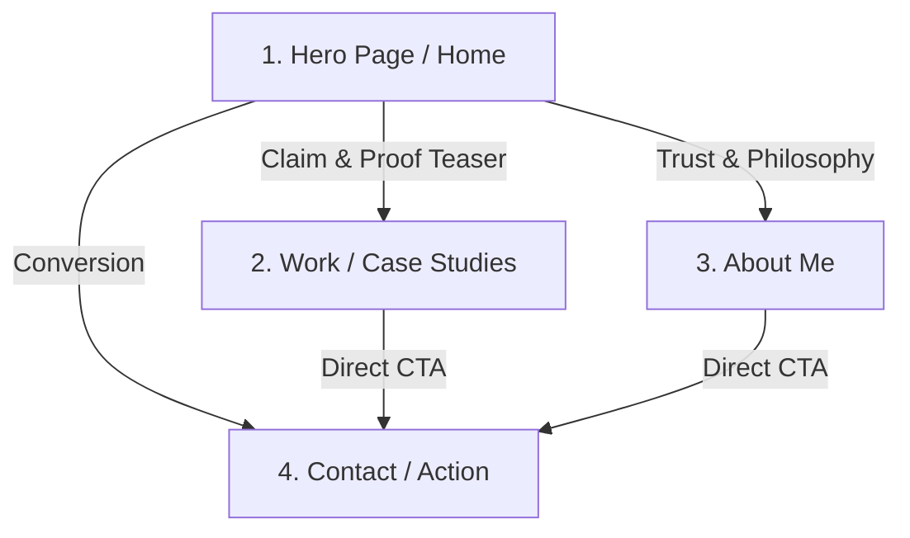

# Portfolio Sitemap & Toolkit Setup — Draw the Path

This document outlines the minimal portfolio sitemap, the custom tutor instructions for the 8-week build, the pressure-test prompt, and the resulting insights/revisions.

---

## 1. The Core Proof Statement & One Action

*   **Target Audience ("One Person"):** Engineering Managers and Technical Recruiters seeking reliable ML Interns/Engineers.
*   **The Hero Claim:** "I build reproducible, leakage-free machine learning pipelines that translate complex warehouse data into clear, ranked business decisions."
*   **The One Action:** Book a 15-minute intro chat or view my GitHub repository capstone.

---

## 2. Minimal Portfolio Sitemap (4 Pages Max)



### Page Breakdown & Earned Rationale:
1.  **Page 1: Hero / Landing (`/`)**
    *   *Purpose:* State the core claim immediately and show top 2 proof metrics.
    *   *Why it earns its place:* Visitors make a decision in 5 seconds. If they don't see what I solve here, they leave.
2.  **Page 2: Work & Case Studies (`/work`)**
    *   *Purpose:* Deep-dive into 2–3 reproducible ML projects (e.g., FlyRank Data Contract & Baseline model).
    *   *Why it earns its place:* Proof is required to substantiate the hero claim. Shows code, methodology, and metrics.
3.  **Page 3: About Me (`/about`)**
    *   *Purpose:* Brief personal background, engineering philosophy, and tool stack.
    *   *Why it earns its place:* Establishes personal context and human credibility without fluff.
4.  **Page 4: Contact / Take Action (`/contact`)**
    *   *Purpose:* Single clear call to action (Calendar booking link + email form).
    *   *Why it earns its place:* Gives the visitor a frictionless way to complete "The One Action".

---

## 3. Claude Project Custom Instructions (8-Week Tutor Persona)

Copy and paste this text into your new Claude Project's **Custom Instructions**:

```text
Role & Persona:
You are an expert ML Engineering Mentor and Technical Tutor assisting me through an 8-week portfolio build. Act as an encouraging but rigorous reviewer.

User Profile:
- Proof Statement: "I build reproducible, leakage-free machine learning pipelines that translate complex warehouse data into clear, ranked business decisions."
- Target Persona: Technical Recruiter / ML Lead looking for disciplined intern/junior talent.
- One Desired Action: Getting the visitor to schedule an interview or view my GitHub capstone repository.

Behavioral Guidelines:
- Challenge assumptions when pages or text do not directly serve the core claim or the one desired action.
- Ask probing questions before writing code or structural layouts.
- Focus on clarity, simplicity, and evidence-backed claims over flashy jargon.
```

---

## 4. Pressure-Test Prompt & Output Analysis

### The Prompt to Run in Claude:
> "Pressure-test my portfolio sitemap against my core claim ('I build reproducible, leakage-free machine learning pipelines that translate complex warehouse data into clear, ranked business decisions') and my one desired action ('Getting a recruiter/manager to schedule a 15-minute call or view my repo'). 
> 
> Review my 4-page structure (Hero, Work, About, Contact). Does every page strictly earn its place? What friction points exist, and what is ONE specific thing I should change to make the path to action faster?"

### Summary of Pressure-Test Results & Key Revisions Made:

*   **Feedback Received:** The 4-page sitemap is lean, but having "Contact" on a completely separate page adds unnecessary friction for busy recruiters.
*   **One Specific Thing Changed:** Embed a quick "Schedule 15-min Call" section directly at the bottom of the **Hero** page and each **Case Study** page, rather than forcing the visitor to navigate to a standalone `/contact` page first.
